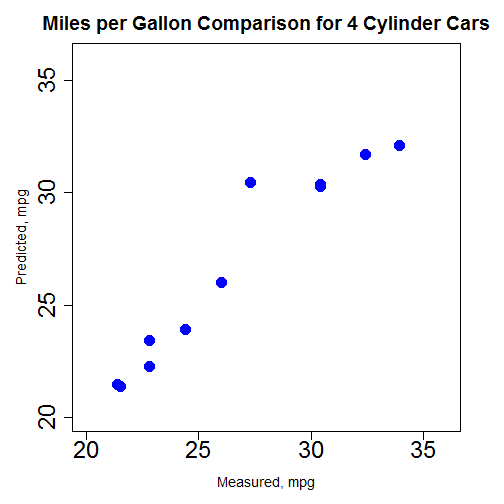
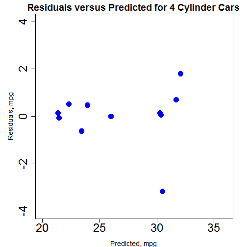

Dynamic Display of Plots using mtcars Data Set
===
author: Nigusseba
date: Sun Jul 03 11:43:29 2016
width: 1440
height: 900
font-family: 'Helvetica'

Overview of Shiny Data Product
===
transition: rotate
This project demonstrates dynamic prediction of fuel consumption of motor vehicles in ***mpg*** for number of cylinders selected by users. The prediction model uses motor vehicles performance data set **mtcars** available in R Studio. The shiny data product demonstrates the following capabilities:

- Select number of cylinders
- Dynamically subset the **mtcars** data set
- Dynamically generate linear model
- Dynamically update plots

Dynamically Subset Data Set and Fit Model
===
Shiny server dynamically subsets the *mtcars* data set for the number of cylinders specified. The number of cylinders choices available are 4, 6, or 8. The radio buttons are used to dynamically switch between the number of cylinders. The default choice is 4. The reactive function allow dynamically updating the sub data set for the selected number of cylinders as shown in the pseudo code below.


```r
NumOfCylinders <- reactive({
NumberOfCylinders <- as.numeric(input$nCyl) # update number of cylinders
return(NumberOfCylinders) })
```


```r
mydf <- reactive({
subset(mtcars, mtcars$cyl==NumOfCylinders()) }) # update subset data
```

The linear model predicts fuel consumption of motor vehicles in *mpg* for the number of cylinders selected using linear regression fit and displays the result as a plot dynamically. A reactive function is used to update the linear model whenever the user switches the number cylinders using the radio button.


```r
lmFit <- reactive({
regressionModelExp <- "mpg ~ ." # linear model expression
lm(regressionModelExp, data=mydf()) }) # update the linear model
```

Predicted MPG Plot for 4 Cylinders Cars
===
Scatter plot of predicted and measured fuel consumption for 4 cylinder cars. If you select the **Four Cylinders** radio button, then you should be able to reproduce the plot shown below.



Residual MPG Plot for 4 Cylinder Cars
===
Residual *mpg* against predicted fuel consumption is shown for 4 cyclder cars. If you run the model and select the *Four Cylinders* and check the *Show Residual Plot* check-box, then you should able to reproduce the plot shown below. You may click the check box *Show Residual Plot* to display or remove the residual plot.





